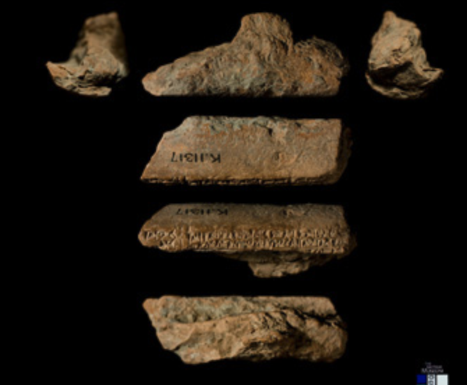

# Nino-cunei

# Cuneiform corpora in Text-Fabric

This repo is a research environment for the study of cuneiform tablets. You can
run your own programs off-line, and publish your work in online notebooks.

# Corpus

This repo contains transliterations of texts of the Nineveh Medical Encyclopedia
(ca. 800 BCE).

This compendium was first described and transliterated as part of the
BabMed Project (Berlin, 2013–2018)
and is now being edited, with normalizations, lemmatization and translations,
in the NinMed Project, which is currently underway (London, 2020–2023).

We have used JSON files provided by NinMed and converted them into a Text-Fabric corpus.

See also
[about](docs/about.md)
and
[transcription](https://github.com/Nino-cunei/ninmed/blob/master/docs/transcription.md).

# Software

The main processing tool is [Text-Fabric](https://github.com/annotation/text-fabric/).
It is instrumental to
turn the analysis of ancient data into computing narratives.

The ecosystem is Python and Jupyter notebooks.

# Getting started

Start with the
[tutorial](https://nbviewer.jupyter.org/github/Nino-cunei/ninmed/blob/master/tutorial/start.ipynb).

# Authors

*   [Dirk Roorda](https://github.com/dirkroorda) at
    [DANS](https://www.dans.knaw.nl)
*   [J. Cale Johnson](https://www.geschkult.fu-berlin.de/e/wissensgeschichte/mitarbeiter_innen/johnson/index.html)
    at the
    [Institut für Wissensgeschichte des Altertums, Freie Universität Berlin](https://www.geschkult.fu-berlin.de/e/wissensgeschichte/index.html)

### Acknowledgements

*   ...

**N.B.:** Releases of this repo have been archived at [Zenodo](https://zenodo.org).
Click the DOI badge to be taken to the archive. There you find ways to cite this work.

# Status

*   2022-02-06 First conversion result delivered as fully functional TF corpus.
