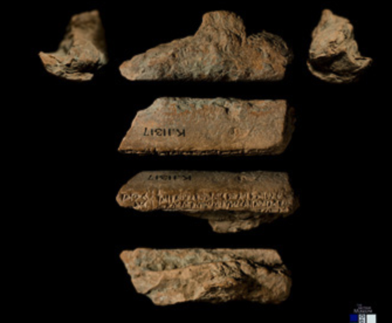

# The Nineveh Medical Encyclopedia

This repo is about the digital processing of the transliterations of
cuneiform tablets with medical content from Nineveh, ca. 800 BCE.

# Cuneiform tablets, ATF and JSON

Cuneiform tablets have been photographed, and transliterated
in [ATF](http://oracc.museum.upenn.edu/doc/help/editinginatf/cdliatf/index.html)
files, in which the marks on a tablet are represented by ascii characters.

While the ATF descriptions preserve an awesome amount of precise information
about the marks that are visible in the clay and their spatial structure, it is
not easy to process that information. Simple things are hard: counting,
aggregating, let alone higher level tasks such as clustering, colocation, and
other statistical operations.

People have wrestled with this overload of encoding in ATF.
For the tablets in this corpus, a JSON representation has been made, which serves
as our starting position.
Not surprisingly, the JSON is every bit as complex as the ATF.

That is why we have converted the JSON to an other format,
[Text-Fabric](https://github.com/annotation/text-fabric)
, which is optimized for processing, adding data and sharing it.

All the essential bits in the JSON have been converted to accessible TF features.
In that way, users can query the data much more easily and precisely with the
help of the Text-Fabric program.

## Corpus

This repo contains transliterations of texts of the Nineveh Medical Encyclopedia
(ca. 800 BCE).

This compendium was first described and transliterated as part of the
[BabMed Project](https://www.geschkult.fu-berlin.de/en/e/babmed/index.html)
(Berlin, 2013–2018)
and is now being edited, with normalizations, lemmatization and translations,
in the
[NinMed Project](http://oracc.museum.upenn.edu/asbp/ninmed/project/index.html),
which is currently underway (British Museum, London, 2020–2023).

Currently, we have converted only 34 tablets from JSON to Text-Fabric.

## Provenance

The JSON files have been handed over by personal communication from Cale Johnson
to Dirk Roorda.

### Transliterations

The JSON files contain plain ATF and interpreted ATF, and include lemmatizations for
a fair number of words.

Where possible we have used the interpreted ATF, since that is the logical, unwrapped
information encoded by the ATF.

We use a handful of the metadata fields.
We have skipped most of the metadata, especially structured metadata that is not essential
for text processing.

We have a
[specification](https://github.com/Nino-cunei/tfFromAtf/blob/master/docs/transcription.md)
of the transcription format and how we model the text in Text-Fabric.
